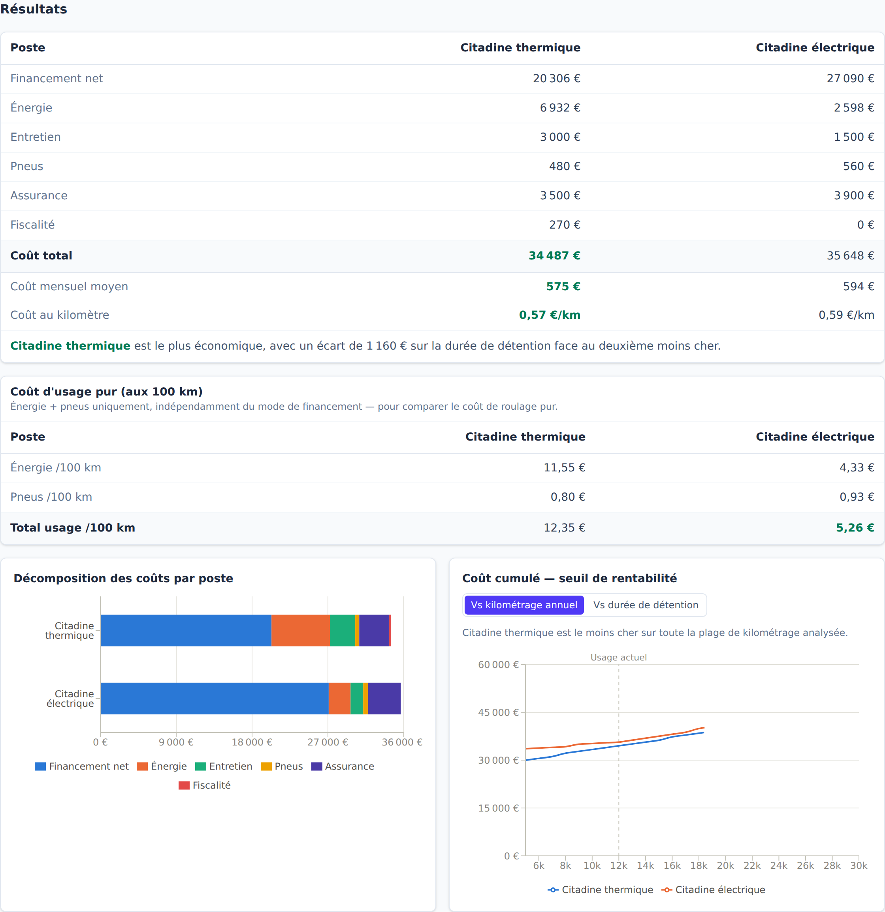
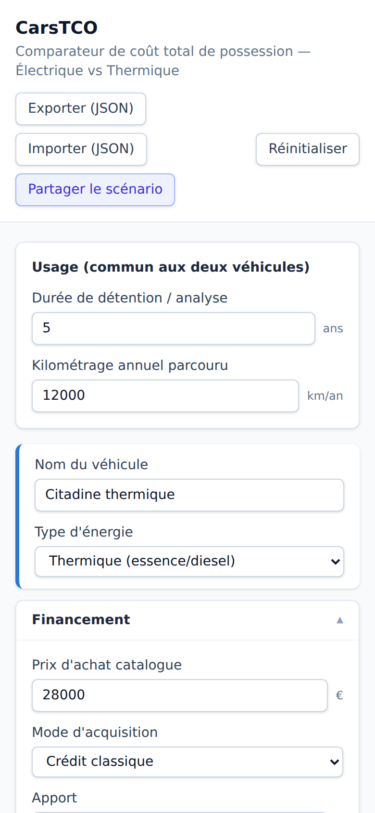

# 🚗⚡ CarsTCO

**Combien coûte vraiment votre prochaine voiture, une fois qu'on a tout compté ?**

Comparez en quelques clics le **coût total de possession** (TCO) de deux
véhicules — électrique, thermique, ou les deux — sur la durée que vous gardez
réellement votre voiture, avec le mode de financement que vous envisagez.

### 👉 [**carstco.remcorp.fr**](https://carstco.remcorp.fr) 👈

 

## Pourquoi cet outil ?

Le prix affiché chez le concessionnaire ne dit presque rien du coût réel
d'une voiture sur 3, 5 ou 8 ans. Entre le financement (comptant, crédit, LOA,
LDD), l'énergie, l'entretien, les pneus, l'assurance, le bonus/malus et la
revente, deux véhicules au même prix catalogue peuvent avoir un TCO très
différent — et le classement peut même s'inverser selon votre kilométrage
annuel.

CarsTCO fait ce calcul à votre place, **en direct** : vous ajustez un
paramètre, tous les résultats se recalculent instantanément, sans bouton
« Calculer ».

## Ce que vous pouvez comparer

- 🔀 **De 2 à 6 véhicules, librement configurables** — thermique vs
  électrique, ou n'importe quelle autre combinaison (ex. thermique vs
  électrique en LOA vs électrique comptant), ajoutés/retirés à la volée
- 🚗 **Modèles types présélectionnables** (citadine essence/électrique,
  berline diesel/hybride, SUV essence/électrique...) pour préremplir un
  véhicule en un clic, à ajuster ensuite librement
- 💳 **4 modes d'acquisition indépendants par véhicule** : achat comptant,
  crédit classique, LOA, LDD/LLD — avec gestion du dépassement kilométrique,
  de la fin de contrat (reconduction, levée d'option, restitution) et des
  postes déjà inclus dans le loyer (pas de double comptage entretien/assurance)
- 🧮 **Calcul automatique du loyer LOA** à partir du prix, de l'option
  d'achat, du taux d'intérêt et de la durée — ou saisie manuelle
- ⛽🔋 **Énergie réaliste** : consommation, prix carburant ou électricité
  (avec répartition domicile / recharge publique pour l'électrique), et
  inflation annuelle en option
- 🔧 Entretien, pneus (calculés au kilomètre), assurance
- 🇫🇷 **Fiscalité française** : malus écologique/au poids, bonus écologique,
  carte grise
- 📉 Décote / valeur de revente en fin de détention
- ⚠️ **Alertes de cohérence** : l'outil signale les saisies suspectes (taux
  aberrant, revente supérieure au prix d'achat, forfait kilométrique très
  éloigné de votre usage réel...)

## Ce que vous obtenez

- **Coût total**, coût mensuel moyen et coût au kilomètre pour chaque véhicule
- Un **tableau de synthèse** qui met en évidence le véhicule le plus économique
- Un **comparatif du coût d'usage pur** (énergie + pneus aux 100 km),
  indépendant du mode de financement choisi
- Un **graphique de décomposition des coûts** par poste (financement, énergie,
  entretien, pneus, assurance, fiscalité)
- Un **graphique de seuil de rentabilité** : à partir de quel kilométrage
  annuel (ou de quelle durée de détention) un véhicule devient plus
  intéressant que les autres
- Un **détail des dépenses par année**, dépliable mois par mois pour chaque
  véhicule (apport/loyers, pneus, revente... aux mois où ils tombent
  réellement)
- Un **export impression / PDF** de la synthèse, prêt à partager

## Vos données restent chez vous

Tout tourne dans votre navigateur — aucun calcul, aucune donnée n'est envoyée
à un serveur.

- Le scénario en cours est **sauvegardé automatiquement** (dans votre
  navigateur) pour ne rien perdre en rechargeant la page
- **Exportez/importez** un scénario au format JSON pour le garder ou le
  réutiliser
- **Partagez un lien** : tous les paramètres sont encodés dans l'URL, la
  personne qui l'ouvre voit exactement le même scénario

## Envie de contribuer ou de faire tourner le projet en local ?

Toute la partie technique (stack, structure du code, hypothèses de calcul,
CI/CD, déploiement) est documentée séparément dans
[`docs/DEVELOPMENT.md`](docs/DEVELOPMENT.md).
